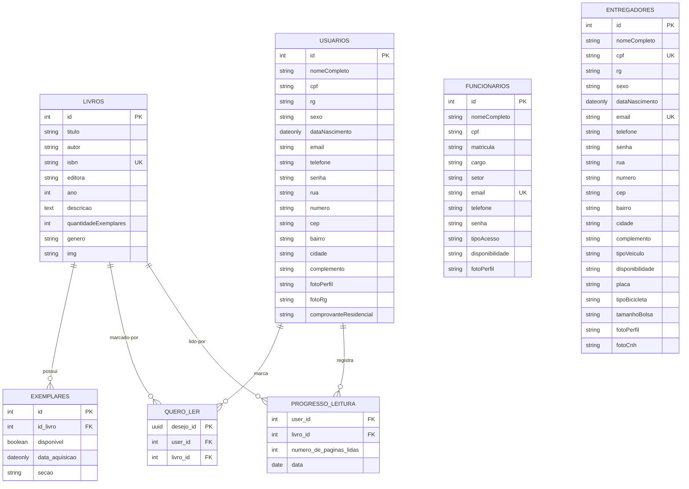

# Acervo 7 Colinas - Backend

Backend do sistema Acervo 7 Colinas, desenvolvido com Node.js, Express, Sequelize e PostgreSQL.

## Tecnologias utilizadas

- Node.js
- Express
- PostgreSQL
- Sequelize
- Docker
- Zod
- Bcrypt
- JWT

## Como rodar o projeto

### 1. Instalar dependências

```bash
npm install
```

### 2. Subir o banco com Docker (abra docker desktop)

```bash
docker compose up -d
```

### 3. Popular o banco com dados iniciais

O seed também sincroniza as tabelas com o Sequelize.

```bash
node src/config/seed.js
```

### 4. Iniciar o servidor

```bash
node server.js
```

O servidor ficará disponível em:

```bash
http://localhost:3000
```

## Acessar o banco no DBeaver

Criar uma nova conexão PostgreSQL com os dados:

```text
Host: localhost
Port: 5432
Database: acervo7colinas
User: postgres
Password: postgres123
```

## Modelo do banco de dados



## Rotas principais

```text
GET /funcionarios
POST /funcionarios

GET /usuarios
POST /usuarios

GET /livros
GET /livros/:id
POST /livros
```

## Observação

O banco é populado com dados iniciais de livros, funcionários e usuário de teste através do arquivo `seed.js`.

## Login

O sistema possui autenticação com bcrypt e JWT.

Usuário de teste criado pelo seed:

Email: usuario@acervo7colinas.com.br  
Senha: 123456

Rota:

POST /login

Body:

{
  "email": "usuario@acervo7colinas.com.br",
  "senha": "123456"
}

Retorno esperado:

{
  "mensagem": "Login realizado com sucesso",
  "token": "..."
}